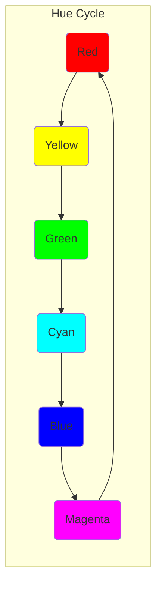
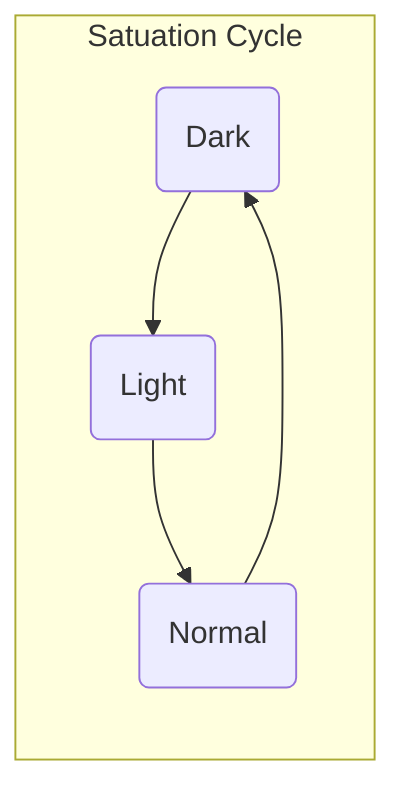

# Piet 

### Table of Contents

1. [Overview](#overview)
2. [Program Code](#programCode)
    * [Codel](#codel)
    * [Codel Block](#codelBlock)
    * [Colors](#colors)
3. [Program Flow](#programFlow)
    * [Program Stack](#programStack)
    * [Commands](#commands)
    * [Color Commands](#colorCommands)
    * [Codel Chooser](#codelChooser)
    * [Direction Pointer](#directionPointer)
    * [Program Execution](#programExecution)
    * [Program Termination](#programTermination)

## Overview 

Piet is an esoteric progrmming language invented by David Morgen-Mar where the code looks like abstract art. 
If you are interested you can also take a look at the original [language specification](https://www.dangermouse.net/esoteric/piet.html).

This is a brief overview of the language and is intended to give the reader the opportunity to understand and apply all the basic language concepts.
So after reading this document you are enabeld to draw pictures and program at the same time.

Since Piet is an esoteric programming language it obviously cannot be used in production. However, writing programs in Piet requires 
creative thinking because normal programming structures do not apply and new solutions must be found.

Happy pieting!

# Program Code 

In Piet you do not write conventional program code in text files like in any other programming language. Instead you draw images which represent
your program code.

The program code (images) consists basically of colored squared blocks which are called Codel (see section [Codel](#codel) for more information) where
each colored block represents a command, e.g. for numberic operations, stack operations or program flow operations - see section [Commands](#commands) for more information.

Piets offers you a set of 20 different [colors](#colors) and a corresponding set of 17 [commands](#commands). The tricky part is that a single color
does not represent the same command in each case. The command interpretation is dependent on the surrounding color blocks and an internal program state.
A red block may represents an add operations, a stack manipulation or a no-op operations in another case - you never know what you will get.

An interesting side fact is that a totally crazy person (positive meaning) managed it to draw an interpreter for the esotheric pramming language Brainfuck.
I did't verified the validity of this program but if you want to do this on your own see this [website](https://lutter.cc/piet/) for more information. 
The more interesting fact is that Brainfuck is Turing-complete, wich implies that Piet is also Turing-complete. Meaning you can theoretically 
programm everythin with Piet assuming you have an infinity sized image and a lot of time. 

## Codel 

A Codel is the smallest programing unit in Piet and is represented as a colored square. The name is obviously a combination of code and pixel.

#### Color
The codel can have 20 different predefined colors (see section [Colors](#colors))

#### Size
The edge length of the square can be defined for each program interpretation and has a dramatically impact on the interpretation result.
E.g. if you define a edge length of 1 at the moment when you draw you program someone else could interpret the same edge length as 10
which results in a completely different result.

## Codel Block 

A codel block consists of 1 to N codels, where N is the total number of codels in the image. 
Following assumptions apply:

* **Color:** All codels in the codel block must have the same color.
* **Codel neighborhood:** The codels in the codel block must necessarily be adjacent through a [4-connected](https://en.wikipedia.org/wiki/Pixel_connectivity) connecivity. So only the top, bottom, left and right codels are valid candidates for a codel block. 
 This neighborhood is illustrated in the table below:

no neighbor (x-1, y+1)      | top neighbor (x, y+1)         | no neighbor (x+1, y+1)
:-------------------------: | :---------------------------: | :-----------------------:
**left neighbor (x-1, y)**  | **current position (x,y)**    | **right neighbor (x+1, y)**
**no neighbor (x-1, y-1)**  | **bottom neighbor (x, y-1)**  | **no neighbor (x+1, y-1)**

## Colors 

The following table shows all 20 colors that can be used in Piet programs:  

The colors black and white are different from all other colers since their interpretation is constant
* **White:** The neutral element which does not cause any command execution.
* **Black:** Blocking elemntes restricting the program flow ([codel chooser](#codelChooser) and [direption pointer](#directionPointer)) 

The remaining 18 colors are divided into 6 different hues: red, yellow, green, cyan, blue and magenta. For each hue there are 
3 different satuations: light, normal and dark. This color set defines the program operations and as already mentioned: the meaning of these colors changes during
the program interpretation.

### Color Cycles

For the program interpretation or more precisely for the command interpretation of the individual code blocks 
the structure of the color table in the section [Colors](#colors) is essentially important.

There are two relevant aspects how the colors are connected:
* Hue cycle

* Satuation cycle

# Program Flow 

## Prgoram stack 

## Commands 

## Color Commands 

## Codel Chooser 

## Direction Pointer 

## Program Execution 

## Program Termination 