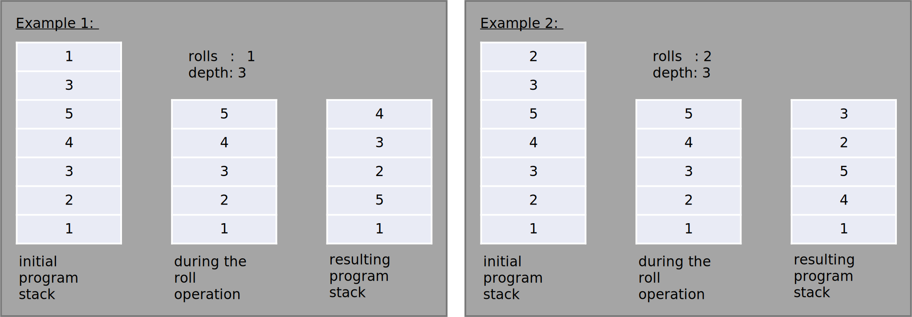

# Piet 


### Table of Contents

1. [Overview](#overview)
2. [Program Code](#programCode)
    * [Codel](#codel)
    * [Codel Block](#codelBlock)
    * [Colors](#colors)
3. [Program Flow](#programFlow)
    * [Program Stack](#programStack)
    * [Commands](#commands)
    * [Color Commands](#colorCommands)
    * [Codel Chooser](#codelChooser)
    * [Determin Next Codel Blocks](#nextCodelBlocks)
    * [Direction Pointer](#directionPointer)
    * [Program Execution](#programExecution)
    * [Program Termination](#programTermination)


## Overview <a name="overview"></a>

Piet is an esoteric progrmming language invented by David Morgen-Mar where the code looks like abstract art. 
If you are interested you can also take a look at the original [language specification](https://www.dangermouse.net/esoteric/piet.html).

This is a brief overview of the language and is intended to give the reader the opportunity to understand and apply all the basic language concepts.
So after reading this document you are enabeld to draw pictures and program at the same time.

Since Piet is an esoteric programming language it obviously cannot be used in production. However, writing programs in Piet requires 
creative thinking because normal programming structures do not apply and new solutions must be found.

Happy pieting!


# Program Code <a name="programCode"></a>

In Piet you do not write conventional program code in text files like in any other programming language. Instead you draw images which represent
your program code.

The program code (images) consists basically of colored squared blocks which are called Codel (see section [Codel](#codel) for more information) where
each colored block represents a command, e.g. for numberic operations, stack operations or program flow operations - see section [Commands](#commands) for more information.

Piets offers you a set of 20 different [colors](#colors) and a corresponding set of 17 [commands](#commands). The tricky part is that a single color
does not represent the same command in each case. The command interpretation is dependent on the surrounding color blocks and an internal program state.
A red block may represents an add operations, a stack manipulation or a no-op operations in another case - you never know what you will get.


An interesting side fact is that a totally crazy person (positive meaning) managed it to draw an interpreter for the esotheric pramming language Brainfuck.
I did't verified the validity of this program but if you want to do this on your own see this [website](https://lutter.cc/piet/) for more information. 
The more interesting fact is that Brainfuck is Turing-complete, wich implies that Piet is also Turing-complete. Meaning you can theoretically 
programm everythin with Piet assuming you have an infinity sized image and a lot of time. 


## Codel <a name="codel"></a>

A Codel is the smallest programing unit in Piet and is represented as a colored square. The name is obviously a combination of code and pixel.

#### Color
The codel can have 20 different predefined colors (see section [Colors](#colors))

#### Size
The edge length of the square can be defined for each program interpretation and has a dramatically impact on the interpretation result.
E.g. if you define a edge length of 1 at the moment when you draw you program someone else could interpret the same edge length as 10
which results in a completely different result.


## Codel Block <a name="codelBlock"></a>

A codel block consists of 1 to N codels, where N is the total number of codels in the image. 
Following assumptions apply:

* **Color:** All codels in the codel block must have the same color.
* **Codel neighborhood:** The codels in the codel block must necessarily be adjacent through a [4-connected](https://en.wikipedia.org/wiki/Pixel_connectivity) connecivity. So only the top, bottom, left and right codels are valid candidates for a codel block. 
 This neighborhood is illustrated in the table below:


no neighbor (x-1, y+1)      | top neighbor (x, y+1)         | no neighbor (x+1, y+1)
:-------------------------: | :---------------------------: | :-----------------------:
**left neighbor (x-1, y)**  | **current position (x,y)**    | **right neighbor (x+1, y)**
**no neighbor (x-1, y-1)**  | **bottom neighbor (x, y-1)**  | **no neighbor (x+1, y-1)**


## Colors <a name="colors"></a>

The following table shows all 20 colors that can be used in Piet programs:  


The colors black and white are different from all other colers since their interpretation is constant
* **White:** The neutral element which does not cause any command execution.
* **Black:** Blocking elemntes restricting the program flow ([codel chooser](#codelChooser) and [direption pointer](#directionPointer)) 

The remaining 18 colors are divided into 6 different hues: red, yellow, green, cyan, blue and magenta. For each hue there are 
3 different satuations: light, normal and dark. This color set defines the program operations and as already mentioned: the meaning of these colors changes during
the program interpretation.

### Color Cycles<a name="colorCycles"></a>

For the program interpretation or more precisely for the command interpretation of the individual code blocks 
the structure of the color table in the section [Colors](#colors) is essentially important.

There are two relevant aspects how the colors are connected:
* Hue cycle


* Satuation cycle


In section [Color Commands](#colorComands) these two cycles are essential.


# Program Flow <a name="programFlow"></a>

This section explains how a piet program is interpreted.


## Program Stack <a name="programStack"></a>

Piet is based on a simple integer stack for program interpretation. During program interpretation 
all values of you program are stores on this stack and you program is also capable of 
manipulating the stack. For a detailed overview of all possible commands and ways of 
stack manipulation please take a look in the [Commands](#commands) section below.

## Commands <a name="commands"></a>

The following commands are present in Piet and can be divided into the following groups:

Stack Manipulation                              | Arithmetic Operation          | Program Flow
 :--------------------------------------------: | :---------------------------: | :--------------------:
[Push](#command_push)                           | [Add](#command_add)           | [Not](#command_not)
[Pop](#command_pop)                             | [Subtract](#command_subtract) | [Greater](#command_greater)
[Duplicate](#command_duplicate)                 | [Multiply](#command_multiply) | [Pointer](#command_pointer)
[Roll](#command_roll)                           | [Divide](#command_divide)     | [Switch](#command_switch)
[Input (number)](#command_input_integer)        | [Mod](#command_mod)           |
[Input (character)](#command_input_character)   |                               |
[Output (number)](#command_output_integer)      |                               |
[Output (character)](#command_output_character) |                               |

### Push <a name="command_push"></a>

**Description:**
Push a number on the stack. The pushed number represents the codel block size of the command.

**Exceptions:** None


### Pop <a name="command_push"></a>

**Description:**
Pop the top element from the program stack.

**Exceptions:** Throws an exeptions if the stack is empty.


### Add <a name="command_add"></a>

**Description:**
Pops the top two elements from the stack, perform an addition and pushes the result back on the stack.

**Operation:** ```result = (2nd top element) + (top element) ```

**Exceptions:** This command can throw an exception if the number of stack elements are insuficcient.


### Subtract <a name="command_subtract"></a>

**Description:**
Pops the top two elements from the stack, perform an subtraction and pushes the result back on the stack.

**Operation:** ```result = (2nd top element) - (top element) ```

**Exceptions:** This command can throw an exception if the number of stack elements are insuficcient.

### Multiply <a name="command_multiply"></a> 

**Description:**
Pops the top two elements from the stack, perform an multiplication and pushes the result back on the stack.

**Operation:** ```result = (2nd top element) * (top element) ```

**Exceptions:** This command can throw an exception if the number of stack elements are insuficcient.

### Divide <a name="command_divide"></a>

**Description:**
Pops the top two elements from the stack, perform an division and pushes the result back on the stack.

**Operation:** ```result = (2nd top element) / (top element) ```

**Exceptions:** This command can throw an exception if the number of stack elements are insuficcientor if the divisor is 0.

### Mod <a name="command_mod"></a>

**Description:**
Pops the top two elements from the stack, perform a modulo operation and pushes the result back on the stack.

**Operation:** ```result = (2nd top element) % (top element)```  - the result has the same sign as the top element. 

**Exceptions:** This command can throw an exception if the number of stack elements are insuficcientor if the divisor is 0.

### Not <a name="command_not"></a>

**Description:** Pops the top value of the stack and pushes back a value, 1 if the popped value was zero otherwise 0.

**Exceptions:** This command can throw an exception if the stack is empty.

### Greater <a name="command_greater"></a>

**Description:**
Pops the top two elements from the stack, compares the two elements and pushes the result back on the stack.

**Operation:** ```result = (2nd top element) > (top element)``` - result: 1 if true, otherwise 0

**Exceptions:** This command can throw an exception if the number of stack elements are insuficcient.

### Pointer <a name="command_pointer"></a>

**Description:** 
Pops the top element from the stack and rotate the direction pointer that many times. If the value is positive the
rotation is clockwise, otherwise counterclockwise.

**Exceptions:** This command can throw an exception if the stack is empty.

### Switch <a name="command_switch"></a>

**Description:**
Pops the top element from the stack and toggles the codel choosers direction that many times. 

**Exceptions:** This command can throw an exception if the stack is empty.

### Duplicate <a name="command_duplicate"></a>

**Description:**
Duplicate the top element of the stack.

**Exceptions:** This command can throw an exception if the stack is empty.

### Roll <a name="command_roll"></a>

**Description:** 
Pops the top two elements from the stack and perform a roll operation. The poped values are 
interpreteded as follows:
* ```rolls```: top value
* ```depth```: 2nd top value

The top stack value is burried in the stack at the value of ```depth``` the remaining elemnts above the burried elements are 
moved one step to the top. This opereration is performed ```rolls``` times.

**Exceptions:** This command throws an exceptions if the number of stack elements is insuficcient or rolling depth exceeds the stack height.

**Example:**


## Input (integer) <a name="command_input_integer"></a>

**Description:**
Requests the input of an interger value and pushes this value on the stack.

## Input (character) <a name="command_input_character"></a>

**Description:**
Requests the input of a character value and pushes this value on the stack.


## Output (integer) <a name="command_interger"></a>

**Description:**
Pops the top element from the stack and outputs this elements interpreteted as an integer.

**Exceptions:** This command can throw an exception if the stack is empty.

## Output (character) <a name="command_character"></a>

**Description:**
Pops the top element from the stack and outputs this elements interpreteted as an character.

**Exceptions:** This command can throw an exception if the stack is empty.


## Color Commands <a name="colorCommands"></a>

The commands in Piet are depending on the current codel block color and the color
of the codel block which will be entered next. For more infomration how the next codel 
block are determined please refer section [Determin Next Codel Blocks](#nextCodelBlocks).

The following table provides the information needed to determine the command:


&nbsp;                  | Current Hue   | Hue +1    | Hue +2    | Hue + 3   | Hue +4            | Hue +5
:---------------------- | :------------ | :-------- | :-------- | :-------- | :---------------- | :-------------------
**Current satuation**   | &nbsp;        | Add       | Divide    | Greater   | Duplicate         | Input (character)
**Satuation + 1**       | Push          | Subtract  | Modulo    | Pointer   | Roll              | Output (integer)
**Satuation + 2**       | Pop           | Multiply  | Not       | Switch    | Input (integer)   | Output (character)


**Usage:**

Based on the [Color Cycles](#colorCycles) and the colors of the current and next codel block the 
command can be determined with the table above.

The command is determined by the the distance between the current colors hue and satuation and the next colors hue and situation. 

**Example #1:**
* Current color: Red
* Next color: Dark Red
* Result: The satuation increases by 1 and the hue does not change, so the result is a ```Push``` operation.

**Example #2:**
* Current color: Dark Blue
* Next color: Light yellow
* Result: Hue + 3, Satuation  + 1, so the resulting command is ```Pointer```


## Codel Chooser <a name="codelChooser"></a>

The Code Chooser (CC) is an internal program state controlling the program flow and is used to dermine 
the next codel block - the Direction Pointer is also needed. 

* **Values:** left, right
* **Initial value:** left 

## Direction Pointer <a name="directionPointer"></a>

The direpction pointer (DP) is an internal program state controlling the program flow and is used to determine the next codel block - the 
Codel Chooser is also needed.

* **Values:** up, right, bottom, down
* **Initial value:** right 

## Determine Next Codel Blocks <a name="nextCodelBlocks"></a>

Determine the next codel block is an essential operation during the interpretation of a Piet program.
Moving from one codel block to the next one are based on the state of the Direction Pointer and the 
Codel Chooser.

Apply the follwing steps:
1. **Step: Determine the codel edge using the Direction Pointer.**
    - This codel edge consists of all codels which have the maximum value in direction. 
    of the Direction Pointer. The edge can be disjoint.
2. **Step: Determine transition position in the edge based on the Codel Choser state.** This is the position
           in the current codel block from which you "walk" to the next codel in direction of the Direction Pointer in the next step.
3. **Step: Find and validate candidate**. Determine the position of the codel in which you would enter the next
           codel block based on the transition position (step 2) and the Direction Pointer. If this position exceeds
           the image boundaries proceed with step 5. 
           If not, pick the codel at this position and proceed as follows depending on the codels color.
    - Color is not Black or white: Candiate is valid.
    - Black: Codel in invalid, proceed to step 5.
    - White: This color is neutral so traverse along the direction of the direction pointer until you reach the border or
            a black codel (then proceed with step 5) or until you found a color different from black or white.
4. **Step: Get next codel block**. Staring on the first codel of the new codel block (step 3) use region growing
           to determine the next codel block.
5. **Step (optional):** If the candidate from the previous step was invalid toggle the Codel Chooser and proceed
                        with step 1. If this fails again, rotate the Direction Pointer clockwise and go back
                        to step 1. This procedure is repeated 8 times until all possible options have been tried - this 
                        triggers the termination of the interpreter.


Direction Pointer | Codel Chooser | Transition Codel
:---------------- | :------------ | :-----------------
up                | left          | leftmost
up                | right         | rightmost
right             | left          | uppermost
right             | right         | lowermost
down              | left          | rightmost
down              | right         | leftmost
left              | left          | lowermost
left              | right         | uppermost


## Program Execution <a name="programExecution"></a>

The program execution starts with the codel block in the top left corner of the Piet program with the 
Direction Pointer facing to the right and the Codel Chooser is set to left.

From this codel the first codel block is determined and the following program flow starts:


## Program Termination <a name="programTermination"></a>

### Sucessfull program termination
The program terminates if there is no next codel available. This can only in the progress of 
finding the next codel block (see section [Determine Next Codel Blocks](#nextCodelBlocks)).

If this happens all possible ways from the current codel block to all possible 8 candiate are tested.


### Termination in case of errors

During the program interpretation errors can occur while executing the commands, e.g. there are 
insuficcient elements on the stack or a division by zero was performed. 


